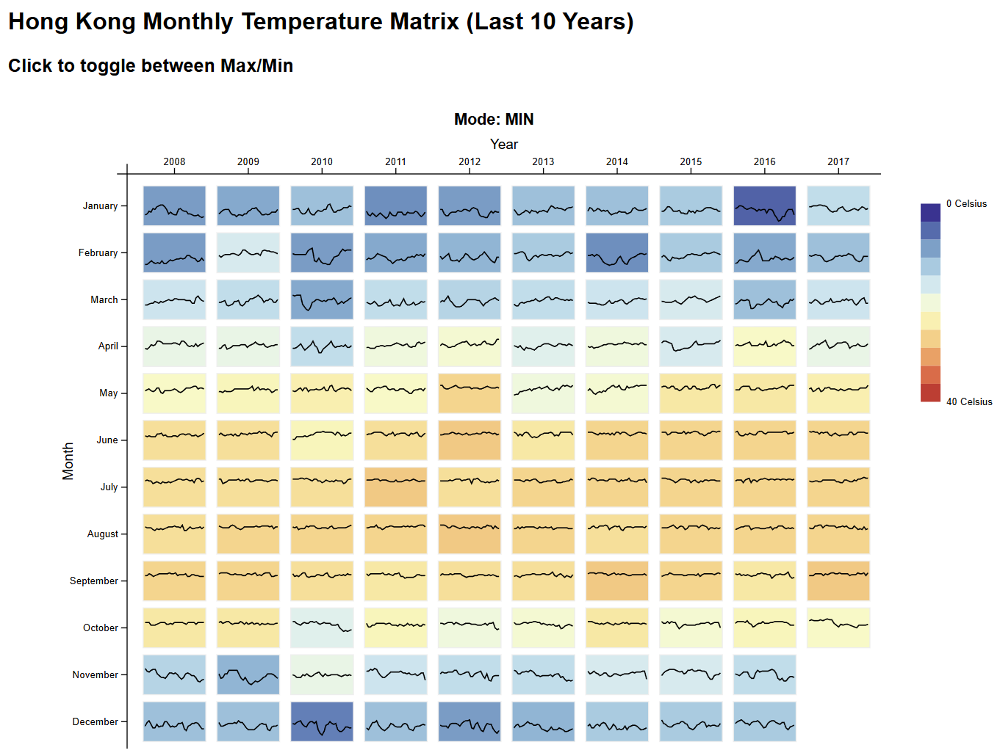
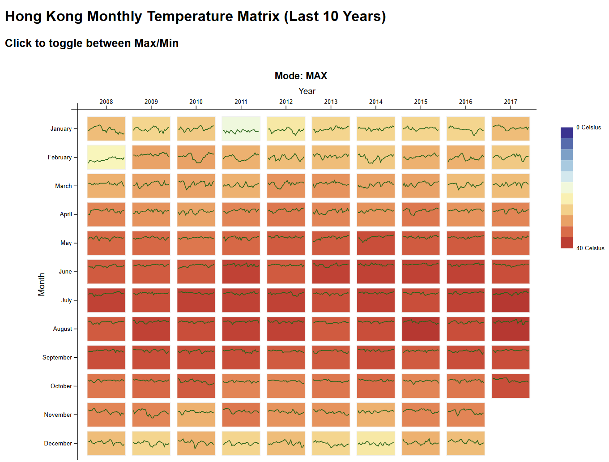

# Instructions to run the code:
- Clone the repo. Make sure your folder looks like this:
```
project-folder/
│── index.html
│── script.js
│── temperature_daily.csv
│── style.css   
|── ...

```
- In the project folder, run: 
```bash
python -m http.server 8000
```

- Then open in browser: http://localhost:8000. You should now see the visualization.

Output of the code (when mode is min):
 

Output of the code (when mode is max):
 